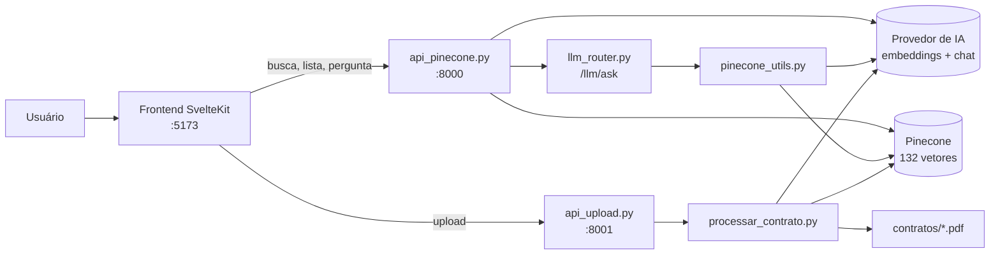
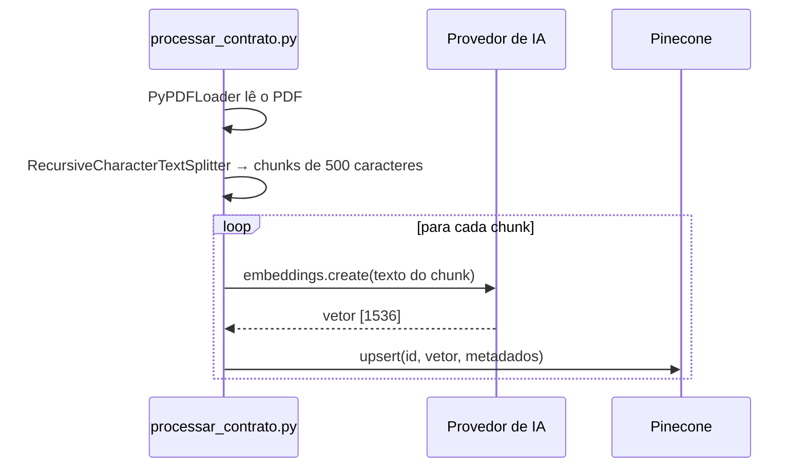
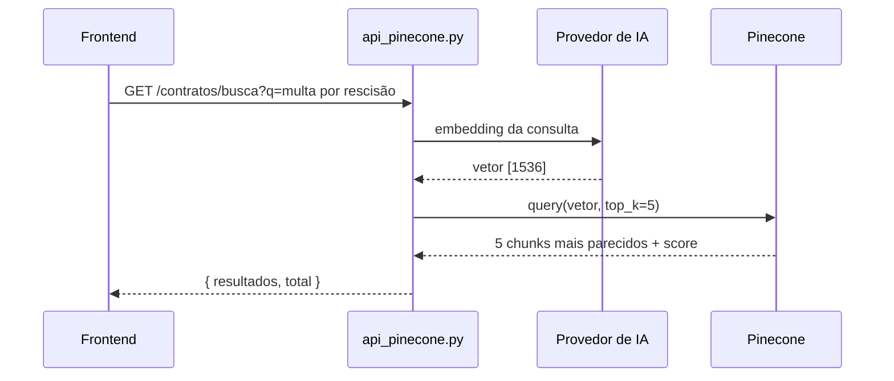
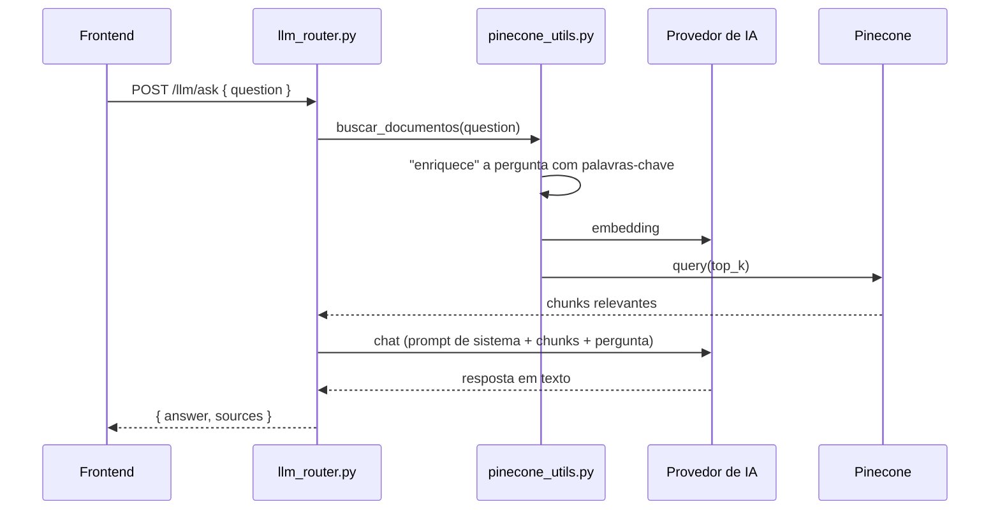

# 01 · Visão geral

## O problema

Você tem uma pasta de contratos em PDF e quer perguntar coisas como *"qual a multa por rescisão no contrato da Carla?"* sem abrir arquivo por arquivo. Uma busca por palavra-chave (Ctrl+F) não basta: a pergunta usa "multa por sair antes", o contrato diz "rescindido antes do prazo".

A solução deste projeto é **busca semântica** (busca por significado) e, em cima dela, **RAG**.

## Conceitos

### Embedding

Um **embedding** é uma lista de números (um vetor) que representa o *significado* de um texto. Textos com sentido parecido geram vetores parecidos, mesmo com palavras diferentes.

Aqui usamos o modelo `text-embedding-3-small`, que transforma qualquer texto em um vetor de **1536 números**:

```
"multa por rescisão"  →  [0.012, -0.034, 0.051, ... ]   (1536 valores)
```

### Similaridade de cosseno

Para saber se dois textos são parecidos, comparamos seus vetores pelo **ângulo** entre eles: a similaridade de cosseno vai de -1 (opostos) a 1 (mesma direção). Os scores que a API retorna (ex.: `0.51`) são exatamente isso.

> Detalhe que causou um bug neste projeto: o cosseno de um vetor só de zeros é indefinido (divisão por zero). Veja o [roteiro de estudo](06-roteiro-de-estudo.md).

### Chunk

Um contrato inteiro é grande demais para virar um único embedding útil: o significado de "valor do aluguel" se perderia no meio de 3 páginas. Por isso cada PDF é cortado em **chunks** (pedaços) de até 500 caracteres, com 50 caracteres de sobreposição entre um e outro para não cortar frases no meio sem contexto.

Os 12 contratos de exemplo viram **132 chunks**. Cada chunk vira um vetor no Pinecone.

### Banco vetorial (Pinecone)

Um banco de dados especializado em guardar vetores e responder rápido à pergunta *"quais são os K vetores mais parecidos com este?"*. Junto de cada vetor guardamos **metadados**: o nome do arquivo, o texto original do chunk, a página etc.

### RAG (Retrieval-Augmented Generation)

Um LLM sozinho não conhece seus contratos. RAG resolve isso em duas etapas:

1. **Retrieval (recuperação):** busca os chunks mais relevantes para a pergunta.
2. **Generation (geração):** envia a pergunta *junto com esses chunks* para o LLM, que responde com base neles.

O ponto fraco do RAG é a etapa 1: se a busca não traz o chunk certo, o LLM não tem como acertar, e responde "não encontrei". Isso acontece neste projeto e é um ótimo exercício (veja o roteiro).

## Arquitetura



São **três processos** rodando ao mesmo tempo:

| Processo | Porta | Papel |
|---|---|---|
| `api_pinecone.py` | 8000 | Lista, busca e responde perguntas |
| `api_upload.py` | 8001 | Recebe PDFs novos e os indexa em segundo plano |
| Frontend (Vite) | 5173 | Interface web |

E dois **serviços externos**: o provedor de IA (OpenRouter ou OpenAI) e o Pinecone.

## Os três fluxos

### 1. Indexação (PDF → Pinecone)

Roda uma vez por contrato, via `processar_contrato.py` ou pelo upload.



### 2. Busca semântica (`GET /contratos/busca`)



### 3. Pergunta ao LLM (`POST /llm/ask`)



Repare que a busca do fluxo 2 e a do fluxo 3 são **implementações diferentes** (uma em `api_pinecone.py`, outra em `pinecone_utils.py`). Os detalhes estão em [03 · Backend](03-backend.md).
