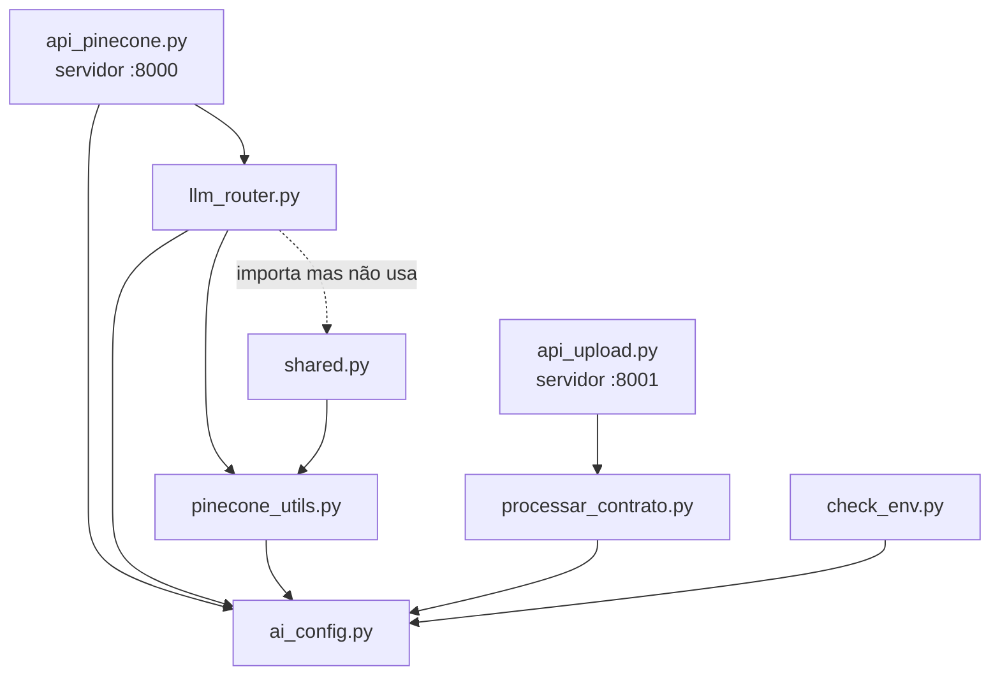

# 03 · Backend

Todos os arquivos Python ficam na raiz do projeto. Esta página percorre cada um, na ordem em que vale a pena ler.

## Mapa de dependências

Quem importa quem (setas = "importa"):



Observe que **não existe uma camada única de acesso ao Pinecone**: `api_pinecone.py`, `pinecone_utils.py` e `processar_contrato.py` têm, cada um, sua própria função de conectar ao Pinecone e de gerar embedding. Entender essa duplicação é parte do estudo.

---

## `ai_config.py`

Configuração central da IA. É o único lugar que cria o cliente.

- Carrega o `.env` da pasta do projeto (independente de onde o comando foi executado).
- `AI_BASE_URL`: URL do provedor. Vazio = OpenAI direto.
- `AI_API_KEY`: cai para `OPENAI_API_KEY` se não existir.
- `AI_MODEL`: modelo de chat; cai para `OPENAI_MODEL` e depois para `gpt-4o-mini`.
- `EMBEDDING_MODEL` e `EMBEDDING_DIM`: modelo de embedding e o tamanho do vetor que ele gera.
- `ai_client`: instância de `openai.OpenAI`. Como OpenRouter e outros provedores falam o mesmo protocolo da OpenAI, basta trocar o `base_url`.

**Conceito:** a biblioteca `openai` é só um cliente HTTP. Quem define o "dialeto" é a API; por isso ela funciona com qualquer provedor compatível.

---

## `processar_contrato.py`

Transforma PDFs em vetores no Pinecone. É o começo de tudo: sem ele, o índice fica vazio.

**Ao ser importado**, verifica se as chaves existem e chama `sys.exit(1)` se faltar alguma. Como `api_upload.py` importa este arquivo, a API de upload também não sobe sem chaves.

| Função | O que faz |
|---|---|
| `gerar_embedding(texto)` | Chama `ai_client.embeddings.create` e devolve o vetor |
| `inicializar_pinecone()` | Conecta ao índice e imprime quantos vetores existem |
| `processar_contrato(caminho_pdf)` | Processa um PDF (detalhado abaixo) e devolve o número de chunks |
| `processar_pasta_contratos(pasta)` | Chama a função acima para cada `.pdf` da pasta |

### `processar_contrato` passo a passo

1. **Leitura:** `PyPDFLoader` (LangChain) extrai o texto, gerando um `Document` por página.
2. **Divisão:** `RecursiveCharacterTextSplitter` com `chunk_size=500` e `chunk_overlap=50`. Ele tenta cortar primeiro em `\n\n`, depois `\n`, depois `CLÁUSULA`, `ARTIGO`, `. `, espaço, e por último em qualquer caractere. Ou seja: prefere cortes "naturais".
3. **Seção:** `identificar_secao(texto)` classifica o chunk por palavras-chave (locador, locatário, objeto, aluguel, prazo...). A **primeira regra que casar vence**.
4. **Metadados** salvos junto com cada vetor:

   ```python
   {
     "arquivo": "Contrato_..._Bruno_Mendes_Oliveira.pdf",
     "texto": "...o texto original do chunk...",
     "pagina": 0, "secao": "Identificação do Locador",
     "tamanho_chunk": 470, "posicao": 3, "total_chunks": 9,
     "data_processamento": "2026-10-09 10:04:02"
   }
   ```

5. **ID:** `<nome do arquivo sem .pdf>_<posição>`, ex.: `Contrato_..._Bruno_Mendes_Oliveira_3`. ID fixo = reprocessar sobrescreve em vez de duplicar.
6. **Upsert:** um `index.upsert` **por chunk** (simples, mas lento: dá para enviar em lotes).

**Execução:**

```bash
.venv/bin/python processar_contrato.py               # pasta inteira
.venv/bin/python processar_contrato.py caminho.pdf   # um arquivo
```

---

## `api_pinecone.py`

O servidor principal (porta 8000). Concentra listagem, busca e, via `llm_router`, as perguntas.

### Inicialização (ao importar o módulo)

1. Lê as variáveis do Pinecone do `.env` e importa a configuração de IA.
2. `conectar_pinecone()` abre a conexão e guarda o índice na variável global `index`. Se falhar, tenta de novo até 3 vezes, esperando 2 s entre tentativas (por recursão).
3. Cria o `app = FastAPI(...)`.
4. Importa `llm_router` **depois** de criar o app e o registra com `prefix="/llm"`. Assim a rota `/ask` do roteador vira `/llm/ask`.
5. CORS liberado para qualquer origem (`allow_origins=["*"]`), o que permite o frontend em :5173 chamar a API em :8000.

### Modelos (Pydantic)

```python
class ContratoResponse(BaseModel):
    arquivo: str
    texto: str
    score: float = 0.0

class SearchResponse(BaseModel):
    resultados: List[ContratoResponse]
    total: int
```

O FastAPI usa esses modelos (`response_model=`) para validar e documentar a resposta. Os mesmos modelos estão duplicados em `shared.py`.

### Endpoints

| Rota | Função | Como funciona |
|---|---|---|
| `GET /` | `read_root` | `describe_index_stats()` e devolve status + total de vetores |
| `GET /contratos` | `listar_contratos` | `listar_ids_ordenados()` → fatia `[skip:skip+limit]` → `buscar_metadados()` |
| `GET /contratos/busca` | `buscar_contratos` | Embedding da consulta → `index.query(top_k=limit)` |
| `GET /contratos/arquivos` | `listar_arquivos` | Metadados de todos os chunks → conjunto de nomes de arquivo |

Funções auxiliares da listagem:

- `listar_ids_ordenados()`: `index.list()` devolve os IDs em páginas. A função junta todas e ordena de forma "natural" (`_2` antes de `_10`).
- `buscar_metadados(ids)`: `index.fetch(ids)` em lotes de 100, mantendo a ordem.

**Padrão de erro usado em todos os endpoints:** se der exceção, tenta reconectar ao Pinecone e chama a si mesmo de novo uma vez. Se falhar de novo, devolve HTTP 500.

> A busca deste arquivo é **direta**: não passa por `pinecone_utils.buscar_documentos` e não faz o "enriquecimento" da consulta. Compare com o `/llm/ask`.

---

## `llm_router.py`

Um `APIRouter` do FastAPI (um "pedaço" de API que outro app inclui) com um único endpoint: `POST /llm/ask`. É aqui que o RAG acontece.

**Entrada e saída:**

```python
class QuestionRequest(BaseModel):
    question: str
    max_results: int = 50     # o frontend envia 3

class QuestionResponse(BaseModel):
    answer: str
    sources: List[dict]       # [{ "filename": ..., "text": ... }]
```

**Passo a passo de `ask_question`:**

1. Valida que a pergunta não está vazia.
2. **Retrieval:** `buscar_documentos(question, max_results)` de `pinecone_utils.py`.
3. Monta o **contexto**: cada chunk vira `[Documento N - arquivo.pdf]\n<texto>`, separados por linha em branco.
4. **Generation:** `client.chat.completions.create` com:
   - uma mensagem `system` dizendo para ser detalhado, estruturado e **citar o documento de origem**;
   - uma mensagem `user` com `Documentos:\n<contexto>\n\nPergunta: <pergunta>`;
   - `temperature=0.5` (0 = mais determinístico, 1+ = mais criativo).
5. Devolve a resposta e a lista de fontes.

O prompt de sistema é o lugar mais fácil para experimentar: mude as instruções e veja como as respostas mudam.

---

## `pinecone_utils.py`

Biblioteca de funções do Pinecone. Na prática, só `buscar_documentos` é usada (pelo `/llm/ask`).

| Função | Usada? | O que faz |
|---|---|---|
| `inicializar_pinecone()` | sim | Abre uma conexão **nova a cada chamada** |
| `gerar_embedding(texto)` | sim | Igual às outras duas cópias do projeto |
| `buscar_documentos(query, top_k)` | sim | Busca semântica com "enriquecimento" (abaixo) |
| `processar_e_indexar_documento(...)` | não | Indexa um texto avulso |
| `listar_todos_documentos(limit)` | não | Ainda usa o truque do vetor de zeros (não funciona com cosine) |

### `buscar_documentos` e o "enriquecimento"

Antes de gerar o embedding, a consulta é alterada:

- Se contém palavras de valor (`valor`, `aluguel`, `multa`, `r$`...) → acrescenta `" valor aluguel preço pagamento R$"`.
- Senão, se contém um destes nomes fixos no código: `eduardo`, `rocha`, `fontenele`, `gabriela`, `bruno`, `ana` → acrescenta `" nome cpf rg identificação contratante locatário inquilino"`.

A ideia era ajudar a busca, mas tem efeitos colaterais: em *"Qual o valor do aluguel da Ana Carolina Silva?"*, as palavras genéricas acrescentadas pesam mais que o nome, e o chunk do contrato dela não aparece no resultado. É um dos exercícios do [roteiro](06-roteiro-de-estudo.md).

A função também procura os metadados `valores_monetarios`, `cpfs` e `nomes`, mas o `processar_contrato.py` nunca grava esses campos, então eles sempre vêm vazios.

---

## `shared.py`

Contém `ContratoResponse`, `SearchResponse` (cópias dos de `api_pinecone.py`) e `buscar_contratos(q, limit)`, uma versão da busca com validação e conversão de erros em `HTTPException`.

`llm_router.py` importa `buscar_contratos`, mas não chama. Hoje este arquivo é essencialmente **código morto**: o histórico mostra que o `/llm/ask` passou a chamar `pinecone_utils` direto para contornar um problema de formato.

---

## `api_upload.py`

Servidor separado (porta 8001) para receber PDFs novos.

| Rota | O que faz |
|---|---|
| `POST /upload/contrato` | Recebe um arquivo (`multipart/form-data`, campo `file`), salva em `contratos/` e agenda o processamento |
| `GET /contratos/lista` | Lista os PDFs **da pasta** (nome, tamanho, data), não do Pinecone |

**`BackgroundTasks`:** o FastAPI responde ao cliente imediatamente e só depois executa `processar_contrato_background`. Assim o upload não fica travado esperando todos os embeddings. A contrapartida é que o cliente não fica sabendo se o processamento deu certo.

Se já existir um arquivo com o mesmo nome, acrescenta um timestamp (`nome_1760000000.pdf`).

> O frontend ainda não tem tela de upload. Para testar, use `curl` ou o arquivo [`exemplos/requisicoes.http`](../exemplos/requisicoes.http).

---

## `check_env.py`

Script de diagnóstico, não faz parte da aplicação. Testa, em ordem: se as variáveis existem, se o embedding funciona e tem a dimensão esperada, se o chat responde e se o índice do Pinecone existe com a mesma dimensão.

---

## `requirements.txt`

| Pacote | Para quê |
|---|---|
| `fastapi`, `uvicorn` | Framework web e servidor ASGI |
| `python-multipart` | Necessário para o FastAPI receber upload de arquivos |
| `pydantic` | Modelos de dados / validação |
| `openai` | Cliente de IA (embeddings e chat) |
| `pinecone` | Cliente do Pinecone |
| `langchain`, `langchain-community`, `pypdf` | Leitura do PDF e divisão em chunks |
| `python-dotenv` | Lê o `.env` |

O arquivo original também listava `sentence-transformers`, `einops`, `pymongo` e `pdfplumber`, que nenhum código importa (o primeiro sozinho instala o PyTorch, vários GB). Foram removidos.
